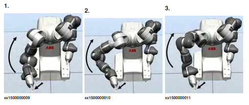

# abb-ros-catkin for Yumi

ABB ROS node forked from MLab, customized for the dual arm 7-DOF Yumi robot. 

## Workspace Setup

We have to set up a catkin workspace, clone the repo and build it. 
```
$ mkdir my-workspace && cd my-workspace
$ catkin init
$ catkin config --extend /opt/ros/indigo
$ catkin config -a --cmake-args -DCMAKE_BUILD_TYPE=RelWithDebInfo
$ cd src
$ git clone https://github.com/mcubelab/rut.git
$ cd ../..
$ catkin_make
```

## Connect with controller

Using the teach pendent, place the robot in `auto`. Then navigate to the `Production Window` and click `PP to Main`. Finally, press the physical `Play` button.

Inside the catkin workspace created above, launch the controller:
```
$ source devel/setup.bash
$ roslaunch robot_node mcubeSystem.launch
```

## ROS Services and Topics Notes

You can view the possible services and topics with `rosservice list` and `rostopic list` respectively. We will detail a few commonly used services.   

### Two Arms
The Yumi has two arms, which run identical controllers. Hence all of the ROS services and ROS topics are the same. The left arm is designated by ‘robot2’ proceeding the topic/service name and the right arm is designated by ‘robot1’. 

### Cartesian Control and Arm Angle
Each Yumi arm has 7 degrees of freedom, which therefore provides kinematic redundancy in our 6D space that we must resolve if want to do cartesian control. The location of the end effector in cartesian space is specified by 7 numbers: 3 for position (x, y, z) and 4 for orientation (given as a quaternion: q0, qx, qy, qz). The redundancy is handled by an additional parameter: the arn angle. 

By changing the arm angle,  the tool center point and the orientation of the tool is fixed in space, hence only the entire angle of the arm moves. The tool center point is neither rotated nor moved. The arm angle does not correspond to a particular joint, but can be retrieved by the service `getRobotAngle`. The figure below shows the arm angle changing. 




There are 3 commands that allow you to set the cartesian location of the end effector by two different strategies. 
1. `SetCartesian` : This takes in the 7 numbers to determine the location (x, y, z, q0, qx, qy, qz).  The arm angle is not specified by the user. Instead the system uses the current robot angle (i.e. what is is set to before the command). Internally this uses the MoveL command, so it will plan in cartesian space. 
2. `SetCartesianJ` : This has the same interface as `SetCartesian` but uses MoveJ internally and hence plans in joint space. 
3. `SetCartesianA` : The takes 8 numbers as input: the 7 for location (x, y, z, q0, qx, qy, qz) and 1 for the arm angle.  Internally this uses MoveL. 


### Execute Trajectories
We can execute a joint space trajectory by adding several poses to a buffer, and then executing that buffer 
```
rosservice call /robot1_ClearJointPosBuffer
rosservice call -- /robot1_AddJointPosBuffer 0 0 0 0 90 0 0
rosservice call -- /robot1_AddJointPosBuffer 0 0 0 0 91 0 0
rosservice call -- /robot1_AddJointPosBuffer 0 0 0 0 89 0 0
rosservice call /robot1_ExecuteJointPosBuffer
```

We can do a similar series of commands for a cartesian space trajectory: 
```
rosservice call /robot1_ClearBuffer
rosservice call /robot1_SetSpeed 50 50 # apply to the following knot points until the next set speed.
rosservice call -- /robot1_AddBuffer 300 0 300 1 0 0 0    # x y z (mm) q0 qx qy qz
rosservice call -- /robot1_AddBuffer 300 0 301 1 0 0 0
rosservice call /robot1_SetSpeed 50 100
rosservice call -- /robot1_AddBuffer 300 0 300 1 0 0 0
rosservice call /robot1_ExecuteBuffer  # go through the whole trajectory
```
Note: Too small spacing between points may cause jerky motions. Try SetZone to higher value.
